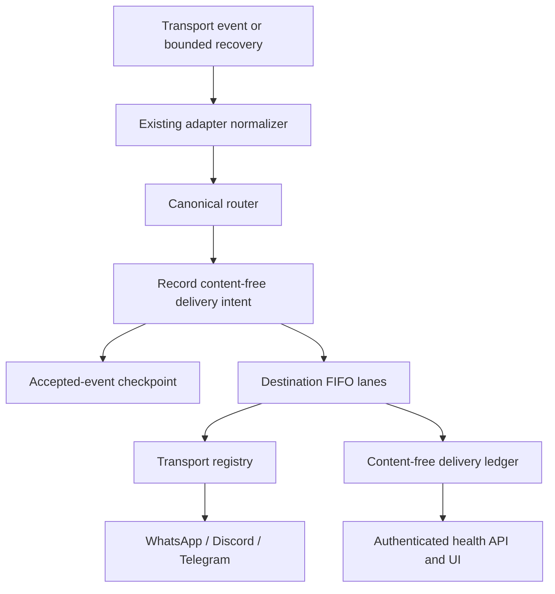
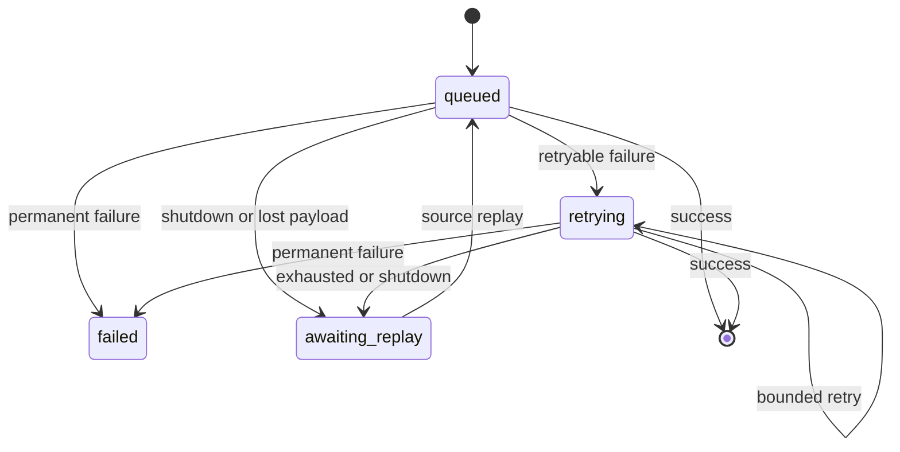
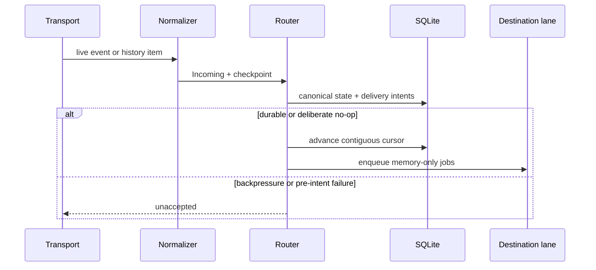

# Must-Have Sync Reliability Implementation Plan

Status: approved implementation plan  
Program branch: `agent/sync-reliability`  
Base: `main@fbc52d26744f944a8773cb361e46b62573f4eaa8`  
Tracker: [MUST_HAVE_SYNC_RELIABILITY_TRACKER.md](MUST_HAVE_SYNC_RELIABILITY_TRACKER.md)  
Issues: [#32](https://github.com/vm75/message-sync/issues/32) through [#44](https://github.com/vm75/message-sync/issues/44)

## 1. Goal

Make cross-group synchronization feel seamless when one destination is slow, a provider is temporarily unavailable, the process restarts, or a Discord webhook is deleted.

The project remains a small, locally hosted, privacy-first Go application:

- one process;
- one canonical router;
- SQLite for content-free operational state;
- message payloads and media held only in memory;
- all-to-all delivery inside the existing sync-set model;
- no broker, cloud service, microservice, or distributed scheduler.

This plan implements only the reliability features classified as must-have. Directed routing, durable payload storage, manual replay controls, advanced telemetry, and complete offline lifecycle reconstruction remain deferred.

## 2. Non-negotiable constraints

1. **KISS/YAGNI:** add only code required by a listed acceptance criterion.
2. **No compatibility work:** the product is not deployed. Modify the current schema/API directly. Do not add migrations, converters, deprecated routes, aliases, or feature flags.
3. **Fresh database:** incompatible development changes require recreating `sync.db`. `whatsapp.db` remains the sensitive protocol-state exception and is not migrated by this work.
4. **No content at rest:** `sync.db` must never contain message text, media, quoted text, poll text/options, display names, phone numbers, raw provider errors, or credentials.
5. **One routing path:** live events and recovered events use the same adapter normalization, canonical router, delivery lanes, and copy mapping.
6. **No version change:** `VERSION` must remain untouched for the entire program.
7. **Shared branch:** issue work is integrated on `agent/sync-reliability`; no implementation commit goes directly to `main`.

## 3. Current architecture and failure modes

Today `internal/app/app.go` reads transport event channels through one select loop and calls `router.Handle` synchronously. `router.Handle` iterates sync-set destinations and calls the registry synchronously.

Consequences:

- a slow destination blocks every later destination in that fan-out;
- the first send/edit/delete/react error stops the loop;
- retries depend on the source event being replayed;
- create/edit/delete can arrive out of order after partial failure;
- Telegram's update offset is in process memory;
- Discord prepares managed webhooks at startup/reload and repairs a deleted or invalid cached webhook once at the failing operation;
- existing cursors do not define a common accepted-event boundary;
- the admin UI cannot show queued, retrying, awaiting-replay, or failed delivery work.

The canonical message/copy mapping, loop prevention, sync-set semantics, privacy aliases, and transport normalizers are sound and should be retained.

## 4. Target architecture



### Component ownership

| Component | Owns | Must not own |
|---|---|---|
| Adapter | provider event filtering/normalization; safe provider error classification; bounded provider history fetch | cross-endpoint routing, retry policy, SQLite, canonical semantics |
| Canonical router | canonical IDs/copies, loop prevention, sync-set fan-out decision, reply/lifecycle resolution, outgoing job construction | provider APIs, durable payloads, worker orchestration |
| Delivery manager | one bounded FIFO lane per destination, execution, retry timers, lifecycle ordering, shutdown | provider-specific parsing, sync-set rules, content persistence |
| Store | canonical/copy mappings, cursors, content-free delivery ledger and safe summaries | message payloads, provider response bodies, credentials |
| Recovery coordinator | accepted-event checkpoint, contiguous acknowledgements, startup/reconnect single-flight recovery | second forwarding path, unbounded polling, payload archive |
| Admin API/UI | authenticated safe delivery/recovery status | raw IDs, cursor values, message inspection, manual replay |

## 5. Delivery model

### 5.1 Per-destination lanes

Each configured endpoint alias gets one bounded in-memory FIFO worker. The router records an operation in SQLite before enqueueing its memory-only payload.

Properties:

- a blocked Discord channel does not block WhatsApp or Telegram lanes;
- one destination's operations retain FIFO order;
- there is no generic worker pool or priority scheduler;
- queue capacity and retry bounds are code constants, not user configuration;
- a full lane is explicit backpressure: mark the row `awaiting_replay` and do not advance the source cursor;
- config reload creates new lanes and stops removed lanes safely.

Media bytes are loaded once, shared read-only among destination jobs, and released after all referencing jobs finish.

### 5.2 Content-free delivery ledger

One current-schema table tracks only active operational metadata. Its idempotent identity is:

```text
canonical message + destination endpoint alias + operation kind + operation revision
```

Allowed data:

- canonical/opaque operation IDs;
- endpoint aliases;
- operation kind and revision;
- state and attempt count;
- next-attempt time;
- safe failure class;
- operational timestamps.

Forbidden data:

- text, media, quoted text, poll text/options;
- display names, phone numbers, raw sender identity;
- remote error bodies/strings;
- tokens, webhook credentials, serialized transport payloads.

The minimal active states are:



Successful creates are represented by `message_copies`; completed mutation rows are deleted. The ledger is not an audit history.

### 5.3 Retry policy

Only safe `transient` and `rate_limited` failures retry. Provider retry-after wins when present; otherwise use a small bounded exponential schedule defined in code. Tests use an injected clock/timer.

Safe failure classes:

- `transient`
- `rate_limited`
- `permission_denied`
- `destination_missing`
- `payload_rejected`
- `unsupported`

Adapters translate provider errors. Router, delivery ledger, API, and logs see only safe classes. Unknown failures default conservatively to retryable `transient`.

### 5.4 Lifecycle ordering

For each canonical message and destination:

1. Create must produce a valid `message_copies` mapping before edit/reaction.
2. Waiting edits coalesce to the newest in-memory revision.
3. Reactions wait for the create mapping and preserve existing echo suppression.
4. If delete arrives before create succeeds, tombstone and cancel the undelivered create/dependents.
5. If a destination copy already exists, delete executes in lane order.
6. Retry/replay uses the same operation identity, so healthy copies are never recreated.

No edit text, reaction fallback, or delete payload is persisted. Restarted active work becomes `awaiting_replay`.

## 6. Checkpoint and recovery model

### 6.1 Accepted boundary

The source cursor represents the highest **contiguous accepted** position, not merely a received event and not remote delivery completion.

An event is accepted when either:

- canonical state and all required destination delivery intents are durable; or
- the router deliberately identifies it as a safe idempotent/irrelevant no-op.

Queue-full or failure-before-intent leaves the event unaccepted. If N is unaccepted, later events cannot advance the durable cursor past N. A restart may replay later events, but canonical/copy/operation identity makes that safe.

### 6.2 One path for live and recovered events



The coordinator starts bounded recovery after adapters, configuration, and lanes are ready. Adapter reconnect can request the same single-flight operation. There is no periodic recovery poller.

The shared Go contract is `transport.RecoverySource`: it supplies safe stream keys, receives a bounded `RecoveryRequest`, emits already-normalized `transport.Incoming` values through a callback, and exposes a reconnect signal. `transport.Incoming.Checkpoint` carries the stream key, ordered numeric position, event timestamp, and validity bit. `internal/recovery.Coordinator` owns per-stream serialization, in-memory acknowledgements for positions after a failed event, durable cursor updates, startup/reconnect single-flight, and the fixed defaults of 200 events and 24 hours. Telegram uses the Bot API client's single long-poll stream as its recovery path: application startup injects the durable `telegram` cursor into the client's initial offset, and replayed updates return through the ordinary adapter event channel and coordinator. Discord uses its bounded REST history source. WhatsApp keeps the existing protocol HistorySync callback, attaches timestamp checkpoints to live and history messages, and serializes in-memory oldest-first replay before returning events through the ordinary adapter channel; it does not implement a second history fetcher.

### 6.3 Provider implementations and honest limitations

| Transport | Recovery source | Cursor scope | Must handle | Known limitation |
|---|---|---|---|---|
| Telegram | Bot API `getUpdates` | one global bot update stream | start at accepted `update_id + 1`, preserve gaps, dedupe replay | Telegram retains updates for a limited provider window |
| Discord | bounded channel history after snowflake | one stream per configured channel endpoint | oldest-first creates; current edited snapshot reconciliation; startup/reconnect; safe per-endpoint history readiness | offline deletes and reaction transitions are not a complete history; missing `VIEW_CHANNEL` or `READ_MESSAGE_HISTORY` is reported as `missing_permission` |
| WhatsApp | existing protocol HistorySync | one stream per configured endpoint, timestamp position | accepted cursor filtering, bounded oldest-first missing-copy reconciliation, live/history serialization | no durable live sequence; offline deletes and reactions are not reliably reconstructable; availability/completeness is controlled by WhatsApp protocol history sync |

Do not persist source snapshots to compensate for provider limitations.

## 7. Discord webhook repair

A Discord operation that proves the cached managed webhook is missing/invalid:

1. invalidates only that channel's in-memory credential;
2. serializes repair per channel;
3. reruns the existing list-or-create preparation;
4. retries the original operation exactly once;
5. returns a safe classified failure if repair fails.

Unknown target message remains idempotent for edit/delete when the webhook itself is valid. Webhook ID/token stay in memory and never enter logs or SQLite.

## 8. Operator visibility

Add one authenticated `GET /api/delivery/status` read model and a compact UI section.

Per endpoint alias it may show:

- lane state;
- queue depth/capacity;
- counts for queued, retrying, awaiting replay, and failed;
- oldest active age rounded to seconds;
- last safe failure class;
- existing safe transport/recovery readiness.

It must not expose checkpoint values, remote message/channel/chat/webhook IDs, message timestamps, identities, content, credentials, or raw errors. Public `GET /health` remains unchanged.

## 9. Implementation sequence

| Phase | Issue | Deliverable | Depends on |
|---|---:|---|---|
| Clean baseline | [#32](https://github.com/vm75/message-sync/issues/32) | remove SQLite v1-v12 migration machinery | — |
| Clean baseline | [#33](https://github.com/vm75/message-sync/issues/33) | remove generic groups API and old `groups` payload naming | #32 |
| Failure contract | [#34](https://github.com/vm75/message-sync/issues/34) | safe transport failure classes | #32, #33 |
| State | [#35](https://github.com/vm75/message-sync/issues/35) | content-free delivery ledger | #32, #33 |
| Isolation | [#36](https://github.com/vm75/message-sync/issues/36) | independent ordered destination lanes | #34, #35 |
| Semantics | [#37](https://github.com/vm75/message-sync/issues/37) | bounded retry and lifecycle ordering | #34-#36 |
| Discord resilience | [#38](https://github.com/vm75/message-sync/issues/38) | managed webhook self-heal | #34, #37 |
| Recovery foundation | [#39](https://github.com/vm75/message-sync/issues/39) | accepted checkpoints and coordinator | #35, #37 |
| Telegram recovery | [#40](https://github.com/vm75/message-sync/issues/40) | persistent Bot API update offset | #39 |
| Discord recovery | [#41](https://github.com/vm75/message-sync/issues/41) | bounded channel history | #38, #39 |
| WhatsApp recovery | [#42](https://github.com/vm75/message-sync/issues/42) | HistorySync reconciliation | #39 |
| Operations | [#43](https://github.com/vm75/message-sync/issues/43) | privacy-safe health API/UI | #35, #37, #39-#42 |
| Integration | [#44](https://github.com/vm75/message-sync/issues/44) | E2E, privacy, race, docs gate | #32-#43 |

The critical path is #32 -> #33 -> (#34 and #35) -> #36 -> #37 -> #39 -> (#40, #41, #42) -> #43 -> #44. #38 can be completed after #37 and before #41/#44.

Even if agents are available concurrently, do not start a dependent issue until its prerequisites are closed and documented. This avoids speculative interfaces and merge churn.

## 10. Testing strategy

Each issue adds the smallest focused tests needed for its boundary. The final gate composes them with fake transports.

Required scenarios:

- healthy all-to-all fan-out across WhatsApp, Discord, and Telegram;
- one slow destination while others remain immediate;
- transient/rate-limit retry then success;
- permanent failure;
- create/edit/reaction/delete ordering;
- queue saturation without silent loss;
- shutdown/restart to awaiting replay;
- checkpoint gap and duplicate replay;
- Telegram offset restart;
- Discord startup/reconnect history and managed webhook replacement;
- WhatsApp bounded HistorySync;
- configuration lane add/remove;
- privacy canaries absent from SQLite, API, and logs.

Required commands at every issue:

```bash
make fmt
make test
make vet
```

Concurrency-sensitive issues also run focused `go test -race`. The final issue runs binary and fresh-volume container smoke tests.

## 11. Documentation and issue closure protocol

Every issue body contains the mandatory completion checklist. An issue is not complete until the implementing agent:

1. updates this plan when code changes an interface, state, dependency, or ownership decision;
2. updates its tracker row with status, commit SHA, exact tests, documentation touched, and follow-up;
3. updates all affected permanent reference docs in the same commit;
4. verifies `VERSION` is unchanged;
5. comments on the issue with summary, files, tests, privacy review, and commit SHA;
6. closes the GitHub issue as completed.

If acceptance criteria cannot be met, leave the issue open and mark the tracker `Blocked` with one concrete next action. Do not silently reduce scope. Non-must-have discoveries become separate deferred issues and do not expand this program.

## 12. Deliberately deferred features

- directed/one-way routing;
- multiple sync-set membership or rules engine;
- persisted encrypted message payload queues;
- Kafka/NATS/Redis or external workers;
- manual retry/replay/cancel UI;
- message inspector, log viewer, or delivery audit history;
- Prometheus/OpenTelemetry/alerts;
- complete offline delete/reaction reconstruction;
- configurable retry policies, queue sizes, or recovery schedules;
- data migration/backward compatibility before first release;
- version/release changes.
